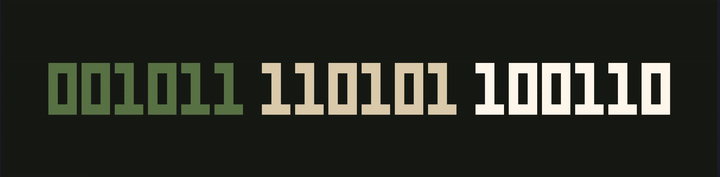

# bitclk

`bitclk` is a terminal clock written in Rust, with `clock`, `stopwatch`, and `timer` modes, plus binary, octal, and hexadecimal displays.



## Features

- `clock`, `stopwatch`, `timer`
- binary / octal / hexadecimal display
- binary views: `dense`, `matrix`, `bcd`
- runtime theme generation via `--theme <HEX>`
- harmony modes: `complementary`, `analogous`, `triadic`, `split-complementary`
- optional `--transparent` background

## Install

```bash
cargo install bitclk
```

Or run locally:

```bash
cargo run -- --help
```

## Quick Start

```bash
bitclk
bitclk clock --hex
bitclk stopwatch
bitclk timer 05:00
bitclk --theme "#3b82f6"
bitclk --theme "#3b82f6" --mode triadic timer 25:00
bitclk theme "#3b82f6"
```

## Controls

Common:

- `b` switch to binary
- `o` switch to octal
- `x` switch to hexadecimal
- `s` cycle binary views: `dense` / `matrix` / `bcd`
- `tab` toggle layout in `dense` / octal / hexadecimal
- `t` cycle preset theme, or cycle harmony mode when launched with `--theme`
- `h` toggle help
- `q` quit

`stopwatch`:

- `space` start / pause
- `r` reset

`timer`:

- `space` start / pause
- `r` reset to current duration
- `0` clear
- `left` / `right` subtract / add 10 seconds
- `up` / `down` add / subtract 1 minute
- `PgUp` / `PgDn` add / subtract 10 minutes

## Theme Preview

Use `bitclk theme <HEX>` to preview a generated theme without entering the clock UI.

## Reference

This project references the ideas and parts of the implementation from [`race604/clock-tui`](https://github.com/race604/clock-tui), especially around the terminal clock / timer / stopwatch experience.

## Development

```bash
cargo fmt
cargo check
cargo test
```
